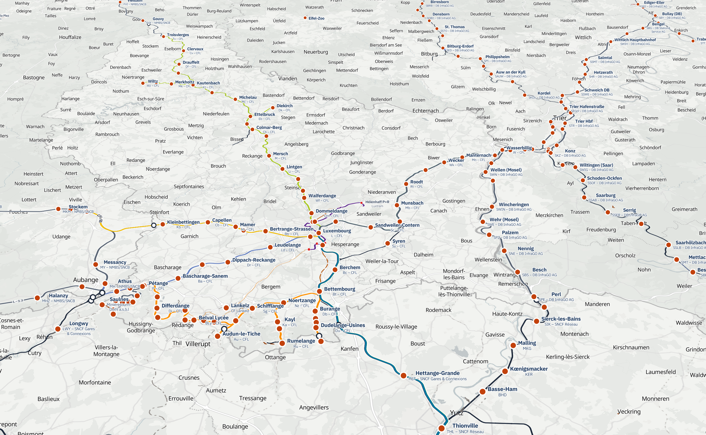
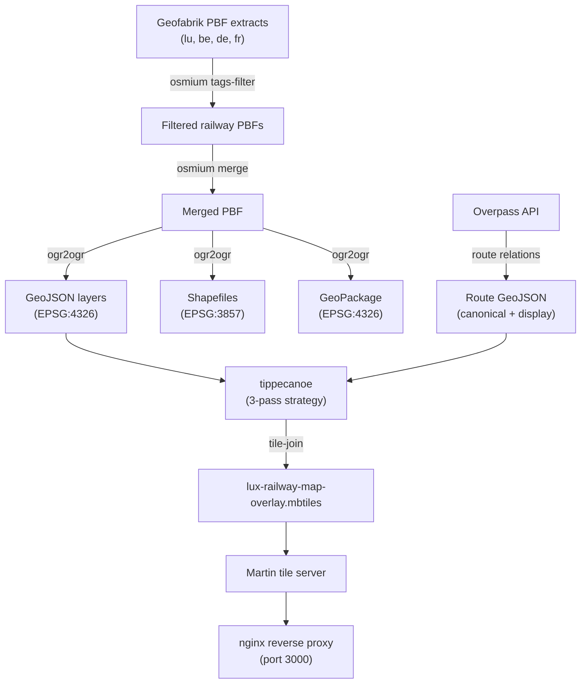

# Luxembourg Railway Infrastructure Vector Tile Overlay

[](https://github.com/Spillgebees/lux-railway-map-overlay/actions/workflows/validate.yml)
[](https://github.com/Spillgebees/lux-railway-map-overlay/actions/workflows/publish-image.yml)
[](https://github.com/Spillgebees/lux-railway-map-overlay/pkgs/container/lux-railway-map-overlay)



Self-hostable railway infrastructure tile server powered by OpenStreetMap data. Generates Luxembourg-focused railway infrastructure tiles with cross-border context from Belgium, Germany, and France, then serves them via MapLibre + Martin.

## Overview

This project produces a transparent vector tile overlay of railway infrastructure relevant to Luxembourg, including adjacent cross-border context from Belgium, Germany, and France.

Pre-built images are available on [GitHub Container Registry](https://github.com/Spillgebees/lux-railway-map-overlay/pkgs/container/lux-railway-map-overlay):

```bash
docker pull ghcr.io/spillgebees/lux-railway-map-overlay:latest
```

Two workflows:

1. **Self-hosted**: Docker-based vector tile server (Martin + nginx), with an optional Blazor WASM viewer for local testing
2. **Raw data for further processing**: generates vector tiles (`.mbtiles`) and a GeoPackage

## Prerequisites

- [Docker](https://docs.docker.com/get-docker/) & [Docker Compose](https://docs.docker.com/compose/)

## Quick Start

1. Generate railway data (runs inside Docker, so no local tools are needed):
```bash
LOCAL_UID=$(id -u) LOCAL_GID=$(id -g) docker compose --profile generate run --rm generate
```
  The Dockerfile defaults to the Luxembourg coverage set (`lu,be,de,fr`) so the generated dataset includes cross-border infrastructure that matters operationally around Luxembourg. The first run downloads ~8 GB of PBF data from Geofabrik and queries the Overpass API for route relations. Subsequent runs skip already-downloaded PBFs.

  The explicit `LOCAL_UID` and `LOCAL_GID` ensure generated files are owned by your host user instead of `root`. If your shell already exports matching values, the Compose defaults are sufficient.

  Route extraction is strict by default. If Overpass is unavailable, generation now fails instead of silently producing empty route layers. For local/manual runs where you explicitly accept missing routes, pass `--allow-missing-routes` to the generator command.

2. Start the tile server:
```bash
docker compose up
```

3. Start the Blazor viewer:
```bash
cd viewer && dotnet run --project RailwayViewer.csproj
```

4. Browse to the URL shown by `dotnet run`

The .NET solution now lives in `viewer/RailwayViewer.slnx`, alongside the Blazor project.

Generated data is split by purpose under `data/`:

1. `data/cache/`: reusable downloaded and queried inputs
2. `data/intermediate/`: working files produced during generation
3. `data/out/`: final deliverables consumed by runtime and external integrations

Operational contract:

1. `data/cache/` is safe to retain across runs and should be the only place that accumulates reusable downloads.
2. `data/intermediate/` is disposable working state; CI and local reruns may replace it at any time.
3. `data/out/` is the only directory the runtime image and external integrations should depend on.
4. The publish workflow validates route presence from `data/intermediate/geojson/` and bundles only `data/out/lux-railway-map-overlay.mbtiles`.

### Generate data for a single country

```bash
LOCAL_UID=$(id -u) LOCAL_GID=$(id -g) docker compose --profile generate run --rm generate --countries lu
```

For a local exploratory build that may proceed without routes:

```bash
LOCAL_UID=$(id -u) LOCAL_GID=$(id -g) docker compose --profile generate run --rm generate --countries lu --allow-missing-routes
```

### Alternative: local generation

If you have `osmium-tool`, `gdal-bin`, `python3` (3.13+), and `tippecanoe` installed locally:
```bash
python3 -m venv .venv && .venv/bin/pip install -e ".[dev]"
cd scripts && python3 -m generator --countries lu --output-dir ../data
docker compose up
```

To allow empty route layers during a local manual run:

```bash
cd scripts && python3 -m generator --countries lu --output-dir ../data --allow-missing-routes
```

## Architecture



### Tools

| Tool                                                             | Purpose                                                               |
| ---------------------------------------------------------------- | --------------------------------------------------------------------- |
| [osmium-tool](https://osmcode.org/osmium-tool/)                  | Filter and merge OpenStreetMap PBF extracts                           |
| [GDAL/ogr2ogr](https://gdal.org/)                                | Convert PBF data to GeoJSON, Shapefiles, and GeoPackage               |
| [tippecanoe](https://github.com/felt/tippecanoe)                 | Generate vector tiles (.mbtiles) from GeoJSON with zoom-level control |
| [Martin](https://maplibre.org/martin/)                           | Serve vector tiles and sprites from MBTiles                           |
| [MapLibre GL](https://maplibre.org/)                             | Client-side vector tile rendering (style specification)               |
| [Overpass API](https://wiki.openstreetmap.org/wiki/Overpass_API) | Query OpenStreetMap for route relations                               |

The pipeline uses a **3-pass tippecanoe strategy** to handle the different density characteristics of the data:

1. **Lines**: track geometry at all zooms, no feature dropping (`-r1 --no-tile-size-limit`), because the Luxembourg regional coverage area cannot fit in 500 KB tiles at low zoom
2. **Stations & routes**: point features that must always be present at their styled zoom, no dropping (`-r1`)
3. **Detail**: dense infrastructure (signals, switches, crossings) that can be thinned at low zoom (`--drop-densest-as-needed`)

The three intermediate `.mbtiles` are merged with `tile-join` into the final `data/out/lux-railway-map-overlay.mbtiles`. Martin serves uncompressed tiles and handles gzip/brotli compression on the wire.

## Developer Docs

Detailed generator architecture, route extraction notes, and data-flow diagrams live in
[docs/developer-pipeline.md](docs/developer-pipeline.md).

## CI and Automation

This repository uses two GitHub Actions workflows with intentionally different scopes:

1. `validate.yml`: fast validation for pull requests and main-branch pushes affecting the generator, tests, styles, tiles, or workflow definitions. It runs Python formatting checks, the Python unit tests, and build-only Docker validation for the generator and tile-server images.
2. `publish-image.yml`: the heavy release pipeline for main only. It generates data, verifies that route layers are present, builds the bundled production image, and publishes it.

The validation workflow does not download Geofabrik extracts or query the Overpass API. Those expensive external dependencies are reserved for the publish workflow and for explicit local generation commands.

## VS Code Tasks

The repository includes a lightweight task layer in `.vscode/tasks.json` for the common local flows:

1. `Generate Data`: run the Dockerized generator with host UID/GID mapping.
2. `Start Tile Server`: run `docker compose up` for the local Martin/nginx stack.
3. `Run Viewer`: start the Blazor viewer, with an optional prompt for the external `Spillgebees.Blazor.Map` project path when you are not using one of the default sibling worktree locations (see Viewer Dependency below).
4. `Validate Fast`: run the same lightweight checks used by the fast validation workflow.

These tasks are intended as the default local command surface so the common workflows stay consistent across contributors.

## Viewer Dependency

The demo viewer currently builds against a local `Spillgebees.Blazor.Map` project reference that lives outside this repository.

Supported resolution order:

1. `BLAZOR_MAP_PROJECT_PATH` environment variable.
2. `BlazorMapProjectPath` MSBuild property.
3. Sibling worktree at `../../worktrees/Blazor.Map/feature/maptiler-pivot/src/Spillgebees.Blazor.Map/Spillgebees.Blazor.Map.csproj`.
4. Sibling worktree at `../../worktrees/Blazor.Map/src/Spillgebees.Blazor.Map/Spillgebees.Blazor.Map.csproj`.

Examples:

```bash
export BLAZOR_MAP_PROJECT_PATH=/absolute/path/to/Spillgebees.Blazor.Map.csproj
cd viewer && dotnet run --project RailwayViewer.csproj
```

```bash
cd viewer && dotnet run --project RailwayViewer.csproj /p:BlazorMapProjectPath=/absolute/path/to/Spillgebees.Blazor.Map.csproj
```

## Local Validation

The repository also ships local pre-commit hooks for the same lightweight checks developers should run before pushing:

1. `black` for Python formatting
2. `csharpier` for C# and project-file formatting
3. `actionlint` for GitHub Actions workflow validation

Install and enable them from the repository root:

```bash
python3 -m venv .venv
.venv/bin/pip install -e ".[dev]"
.venv/bin/pre-commit install
dotnet tool restore
```

Run all configured hooks on demand:

```bash
.venv/bin/pre-commit run --all-files
```

The fast local equivalents of the CI checks are:

```bash
.venv/bin/black --check scripts tests
.venv/bin/pytest
dotnet csharpier check viewer
actionlint
```

## Tile Server

The `tiles` service runs Martin behind nginx on port 3000. Key endpoints:

| Endpoint                               | Description                        |
| -------------------------------------- | ---------------------------------- |
| `/style.json`                          | MapLibre style with rewritten URLs |
| `/fonts/{fontstack}/{range}.pbf`       | Self-hosted glyph PBFs             |
| `/sprite/symbols`                      | SVG sprite sheet                   |
| `/lux-railway-map-overlay`             | TileJSON metadata                  |
| `/lux-railway-map-overlay/{z}/{x}/{y}` | Vector tile endpoint               |
| `/catalog`                             | Martin tile catalog                |
| `/health`                              | Health check                       |

### PUBLIC_URL

By default, URLs in `style.json` point to `http://localhost:3000`. To rewrite them for production, pass `PUBLIC_URL` as an environment variable when running Compose, or set it in a local `.env` file that Compose reads:

```bash
PUBLIC_URL=https://tiles.example.com docker compose up
```

```dotenv
PUBLIC_URL=https://tiles.example.com
```

### Cloudflare caching

When deploying behind Cloudflare, vector tiles are cacheable by default (`.pbf` responses). The nginx layer sets appropriate cache headers. No special configuration is needed beyond proxying through Cloudflare.

### Hosted glyph stacks

The tile image ships self-hosted MapLibre glyphs for these font stacks:

- `IBM Plex Sans Regular`
- `IBM Plex Sans Bold`
- `Noto Sans Regular`
- `Noto Sans Italic`
- `Noto Sans Bold`

These are served from `/fonts/{fontstack}/{range}.pbf` and are used by `styles/style.json`.


## Styling

Map styling is defined in [`styles/style.json`](styles/style.json), a MapLibre Style Specification document with 46 layers across a transparent background. The styles are original work licensed under MIT.

Every feature type is distinguishable by at least two visual channels (color + dash pattern, color + shape, or color + luminance contrast) so the overlay remains usable for people with color vision deficiency and on any basemap.

**Visible by default:**

- **Railway tracks**: one layer per type (rail, light rail, subway, narrow gauge, monorail, funicular, miniature), each with a unique color and dash pattern, plus service tracks in neutral gray
- **Tunnels**: desaturated lines with tunnel entrance icons and name labels
- **Lifecycle states**: one layer per state (construction, proposed, disused, abandoned, preserved, razed), each with a unique dash pattern and opacity
- **Stations & halts**: circles with name, operator, and railway ref labels; sort priority by UIC reference
- **Border crossings**: white circles with dark stroke at network boundaries
- **Platforms**: purple fill at z12-14, transitioning to 3D extruded platforms at z14+ with ref labels

- **Routes**: railway route relations colored by OSM `colour` tag, offset from the track (route lines and labels visible, casing hidden by default)

**Hidden by default (toggled on by the user):**

- **Tram**: tram lines (dashed), tunnels, stops (rounded-square icon), subway entrances (triangle icon), and lifecycle states
- **Infrastructure**: switches, signals, buffer stops, milestones, turntables, derails, track crossings, owner changes
- **Crossings**: road-rail level crossings and tram crossings

## For Consumers

For a full integration guide with source layer reference, property tables, and working examples, see [docs/consumer-integration.md](docs/consumer-integration.md).

To overlay the railway tiles on your own basemap in MapLibre:

```javascript
const map = new maplibregl.Map({
  style: "your-basemap-style-url",
});

// Add railway tiles as a second style
map.addSource("railway", {
  type: "vector",
  url: "https://tiles.example.com/lux-railway-map-overlay"
});
```

Or use MapLibre's style composition to load the full railway style as an overlay:

```
Styles: [basemap-style-url, "https://tiles.example.com/style.json"]
```

### Glyph requirements for composed styles

MapLibre text rendering uses style glyph endpoints, not browser web fonts. In practice that means composed styles need one shared glyph service that contains every font stack referenced by every participating style.

This repository hosts glyphs for the railway overlay's stacks and for `Noto Sans`, which is commonly required by third-party basemaps. If your basemap also uses other stacks, one of these must be true:

1. Both styles resolve to the same glyph endpoint, and that endpoint serves all required stacks.
2. You extend [tiles/glyphs/generate-glyphs.sh](tiles/glyphs/generate-glyphs.sh) to add the missing fonts and rebuild the tile image.
3. Your map component supports an explicit composed glyph override and you point both styles at a compatible shared glyph service.

Supplying CSS `@font-face` web fonts alone does not satisfy MapLibre's `glyphs` requirement.

## Data Attribution

Railway data is sourced from [OpenStreetMap](https://www.openstreetmap.org/) and licensed under the [Open Database License (ODbL)](https://opendatacommons.org/licenses/odbl/).

(c) OpenStreetMap contributors

For any public distribution of generated database-form outputs such as the GeoPackage, or for a public service backed directly by those database artifacts, keep the OpenStreetMap attribution visible and be prepared to provide the corresponding derived database under the ODbL terms.

See [THIRD_PARTY_NOTICES.md](THIRD_PARTY_NOTICES.md) for a summary of third-party software, fonts, and data-source notices used by this repository.

## License

This project is licensed under the [MIT License](LICENSE).
