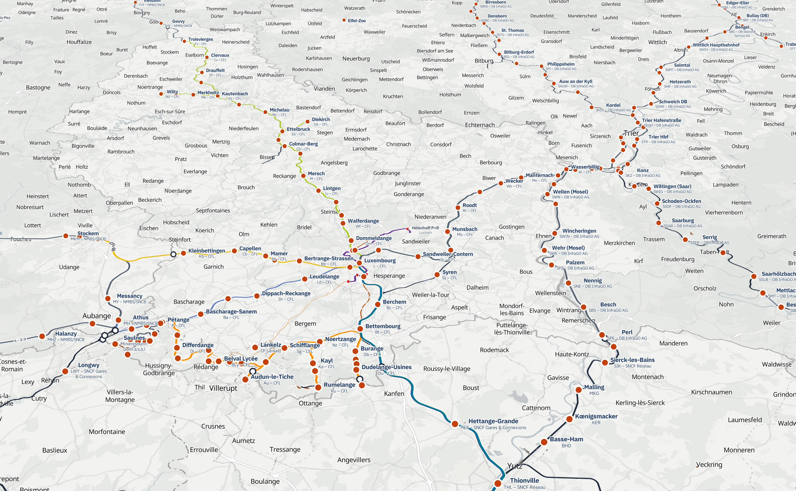

<div align="center">
    
    <p><em>railway overlay on top of a Positron basemap, Luxembourg City</em></p>
</div>

[](https://github.com/Spillgebees/lux-railway-map-overlay/actions/workflows/validate.yml)
[](https://github.com/Spillgebees/lux-railway-map-overlay/actions/workflows/publish-image.yml)
[](https://github.com/Spillgebees/lux-railway-map-overlay/pkgs/container/lux-railway-map-overlay)
[](LICENSE)

`lux-railway-map-overlay` is a railway infrastructure overlay for Luxembourg, built from [OpenStreetMap](https://www.openstreetmap.org/) data and served as vector tiles by [Martin](https://maplibre.org/martin/).

The overlay has a transparent background and no basemap. You pick the basemap and draw the railway layers on top. Coverage includes cross-border lines from Belgium, Germany, and France.

See the [consumer integration guide](docs/consumer-integration.md) to add the overlay to a MapLibre map, [self-hosting](docs/self-hosting.md) to run the tile server, and the [developer pipeline notes](docs/developer-pipeline.md) to work on the generator.

## Features

- Vector tiles (`.mbtiles`) for tracks, lifecycle states, stations, platforms, routes, crossings, and trackside infrastructure
- A MapLibre style with layer metadata for building family, mode, and lifecycle toggles
- Self-hosted glyphs and an SVG sprite, so the style needs no third-party font or icon service
- A GeoPackage export for GIS tools such as QGIS
- A container image with the data baked in, a Docker Compose setup, and a Helm chart

## Quick start

Run the published image. It already contains the generated tiles.

```bash
docker run --rm -p 3000:8080 ghcr.io/spillgebees/lux-railway-map-overlay:latest
```

The style is now at `http://localhost:3000/style.json`. Point a MapLibre map at it, or follow the [consumer integration guide](docs/consumer-integration.md).

If the server is reachable under another URL, set `PUBLIC_URL` so the style points at it:

```bash
docker run --rm -p 8080:8080 -e PUBLIC_URL=https://tiles.example.com ghcr.io/spillgebees/lux-railway-map-overlay:latest
```

Each build is tagged with a release version such as `2026.1003.76` (year, month and day, run number), `latest`, and `sha-<commit>`. Pin the release version for reproducible deployments. CI rebuilds the image when the generator, styles, or tile server change on `main`, and once a month to pick up new OpenStreetMap edits.

## Generate the data yourself

You need [Docker](https://docs.docker.com/get-docker/) with [Docker Compose](https://docs.docker.com/compose/). The generator runs in a container, so no other tools are required.

```bash
LOCAL_UID=$(id -u) LOCAL_GID=$(id -g) docker compose --profile generate run --rm generate
docker compose up
```

The first command builds the generator image and writes the tiles to `data/out/lux-railway-map-overlay.mbtiles`. `LOCAL_UID` and `LOCAL_GID` make your host user own the files. Without them, Compose falls back to `1000:1000`.

The second command builds the tile server image, mounts `./data`, and serves it at `http://localhost:3000`.

The default run covers Luxembourg, Belgium, Germany, and France. The first run downloads more than 10 GB of extracts from Geofabrik, most of it Germany and France, and queries the Overpass API for route relations. Later runs reuse both.

To build a smaller dataset, pass your own arguments. Options you leave out keep their defaults, and the output still lands in `./data`:

```bash
LOCAL_UID=$(id -u) LOCAL_GID=$(id -g) docker compose --profile generate run --rm generate --countries lu
```

| Option                   | Description                                                                                      |
| ------------------------ | ------------------------------------------------------------------------------------------------ |
| `--countries`            | Comma-separated country codes: `lu`, `be`, `de`, `fr`. Defaults to all four.                     |
| `--output-dir`           | Root of the `cache/`, `intermediate/`, and `out/` directories. Defaults to `$OUTPUT_DIR`, else `./data`. |
| `--allow-missing-routes` | Write empty route layers if Overpass fails, instead of failing the run. For local exploration only. |

The generator image sets `OUTPUT_DIR=/data`, which is where Compose mounts `./data`.

Route extraction is strict by default, so an Overpass outage fails the run rather than producing a tileset without routes.

The [developer pipeline notes](docs/developer-pipeline.md) cover the output layout, how to force a fresh download, and how to run the generator without Docker.

## Use the overlay in a map

The tile server publishes a complete style at `/style.json` and the TileJSON for the tiles at `/lux-railway-map-overlay`. You can add the whole style on top of your basemap, or add the tile source and style individual layers yourself.

```javascript
map.addSource("railway", {
  type: "vector",
  url: "https://tiles.example.com/lux-railway-map-overlay",
});
```

MapLibre renders text from glyph PBFs, not from CSS web fonts. When you combine this style with a basemap, both have to load glyphs from one endpoint that serves every font stack they use. The tile server hosts IBM Plex Sans and Noto Sans for that reason.

The [consumer integration guide](docs/consumer-integration.md) has the source layer reference, property tables, toggle metadata, filter examples, and glyph options.

## Deploy

- Docker: run the published image as shown in the quick start. The [self-hosting guide](docs/self-hosting.md) lists endpoints, environment variables, and cache headers.
- Docker Compose: [`docker-compose.yml`](docker-compose.yml) builds the tile server from source and serves tiles from `./data`.
- Kubernetes: install the Helm chart from GHCR. Each chart version deploys the image with the same version.

  ```bash
  helm install railway-tiles oci://ghcr.io/spillgebees/charts/lux-railway-map-overlay --version <version>
  ```

  The [chart README](charts/lux-railway-map-overlay/README.md) covers values, TLS, and scaling.

## Development

The repository has four parts:

- `scripts/generator/`: the Python data pipeline
- `styles/`: the MapLibre style and SVG icons
- `tiles/`: the tile server image, which runs nginx in front of Martin
- `viewer/`: a Blazor WebAssembly demo built on [`Spillgebees.Blazor.Map`](https://github.com/Spillgebees/Blazor.Map)

To run the demo viewer against a local tile server, install the [.NET 10 SDK](https://dotnet.microsoft.com/download) and run:

```bash
cd viewer && dotnet run --project RailwayViewer.csproj
```

Then open the URL that `dotnet run` prints. The viewer reads the tile server URL from `viewer/wwwroot/appsettings.json` and uses the OpenFreeMap Positron basemap.

To run the checks CI runs, install [uv](https://docs.astral.sh/uv/) and run:

```bash
uv sync
dotnet tool restore
uv run ruff format --check
uv run ruff check
uv run basedpyright
uv run pytest
dotnet csharpier check viewer
dotnet build viewer/RailwayViewer.slnx -warnaserror
```

CI also validates the style, the Helm chart, shell scripts, and JSON and CSS formatting; the [developer pipeline notes](docs/developer-pipeline.md#checks-and-ci) list every check. `uv run pre-commit install` sets up the formatting, lint, and type checks as Git hooks, including Biome, ShellCheck, and actionlint. `.vscode/tasks.json` has tasks for generating data, starting the tile server, running the viewer, and running the checks.

The [developer pipeline notes](docs/developer-pipeline.md) describe the pipeline stages, route extraction heuristics, and the CI workflows.

## Attribution and license

Railway data comes from [OpenStreetMap](https://www.openstreetmap.org/) and is available under the [Open Database License (ODbL)](https://opendatacommons.org/licenses/odbl/).

**© OpenStreetMap contributors**

Show this attribution on every map, export, and service that uses the generated tiles or GeoPackage. The TileJSON already includes it, so MapLibre's attribution control shows it when you add the source. If you publicly distribute the GeoPackage or another database-form output, or run a public service backed directly by one, the ODbL may also require you to offer the derived database.

The code and styles in this repository are licensed under the [MIT License](LICENSE). [THIRD_PARTY_NOTICES.md](THIRD_PARTY_NOTICES.md) lists the licenses of the tools, fonts, icons, and data sources used here.
