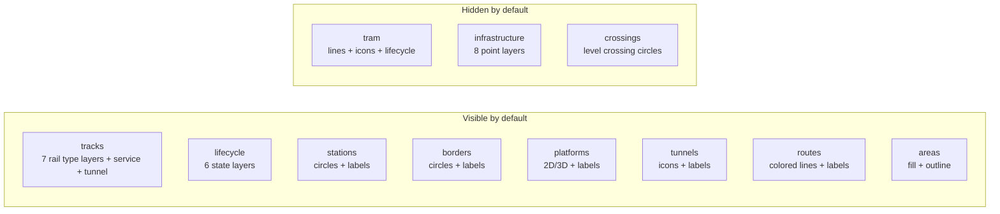

# Consumer Integration Guide

This document describes how to consume the Luxembourg railway infrastructure vector tiles and style in your own MapLibre-based application.

## Quick Start

Add the railway overlay as a second source on top of your basemap:

```javascript
const map = new maplibregl.Map({
  container: "map",
  style: "your-basemap-style-url",
  center: [6.13, 49.61],
  zoom: 8,
});

map.on("load", () => {
  // add the railway tile source
  map.addSource("railway", {
    type: "vector",
    url: "https://your-tile-server/lux-railway-map-overlay",
  });

  // add a single layer (example: main railway lines)
  map.addLayer({
    id: "railway-lines",
    type: "line",
    source: "railway",
    "source-layer": "railway_lines",
    filter: ["!=", ["get", "railway"], "tram"],
    paint: {
      "line-color": "#1e293b",
      "line-width": 2,
    },
  });
});
```

Or load the full pre-built style as a composable overlay:

```javascript
// MapLibre style composition (two style URLs)
const map = new maplibregl.Map({
  container: "map",
  style: [
    "your-basemap-style-url",
    "https://your-tile-server/style.json",
  ],
});
```

## Tile Server Endpoints

| Endpoint | Description |
|---|---|
| `/style.json` | Full MapLibre style with all layers pre-configured |
| `/lux-railway-map-overlay` | TileJSON metadata (source URL for `addSource`) |
| `/lux-railway-map-overlay/{z}/{x}/{y}` | Vector tile endpoint |
| `/fonts/{fontstack}/{range}.pbf` | Self-hosted glyph PBFs |
| `/sprite/symbols` | SVG sprite sheet |
| `/health` | Health check |

## Layer Groups at a Glance



## Source Layers

The vector tiles contain the following source layers. Each layer is available from its listed minimum zoom level onward.

### Line Layers

| Source Layer | Contents | Min Zoom | Key Properties |
|---|---|---|---|
| `railway_lines` | Active track geometry (rail, light_rail, tram, subway, narrow_gauge, monorail, funicular, miniature) | 2 | `railway`, `name`, `service`, `tunnel`, `bridge`, `operator`, `gauge`, `electrified`, `maxspeed` |
| `railway_lines_lifecycle` | Non-active track states (construction, proposed, disused, abandoned, preserved, razed) | 8 | `railway`, `name`, `construction`, `proposed`, `disused`, `abandoned` |

### Station Layers

| Source Layer | Contents | Min Zoom | Key Properties |
|---|---|---|---|
| `railway_stations` | Stations, halts, tram stops, subway entrances, border crossings | 7 | `railway`, `name`, `uic_name`, `uic_ref`, `railway_ref`, `operator`, `network_short`, `public_transport` |
| `railway_routes` | Canonical route geometry (unmodified centerline) | 5 | `ref`, `name`, `route`, `operator`, `colour`, `network`, `from`, `to`, `display_colour`, `display_text_colour`, `source_colour`, `route_offset_slot` |
| `railway_routes_display` | Display-ready route geometry (laterally offset for parallel routes) | 5 | Same properties as `railway_routes` |

### Detail Layers

| Source Layer | Contents | Min Zoom | Key Properties |
|---|---|---|---|
| `railway_crossings` | Road-rail level crossings and tram crossings | 11 | `railway` (`level_crossing`, `crossing`, `tram_level_crossing`, `tram_crossing`), `name` |
| `railway_platforms` | Platform polygons | 10 | `railway`, `ref`, `name`, `public_transport` |
| `railway_platform_refs` | Synthesized platform label points (from platform polygons and stop positions) | 12 | `platform_label`, `platform_label_short`, `platform_name_label`, `platform_ref_label`, `ref`, `local_ref`, `source_layer`, `source_id` |
| `railway_signals` | Railway signals | 12 | `railway`, `name` |
| `railway_switches` | Track switches / points | 13 | `railway`, `name` |
| `railway_buffer_stops` | Buffer stops (end-of-track bumpers) | 14 | `railway`, `name` |
| `railway_derails` | Derail devices | 14 | `railway`, `name` |
| `railway_track_crossings` | Track-to-track crossings (diamond crossings) | 13 | `railway`, `name` |
| `railway_milestones` | Distance markers along tracks | 14 | `railway`, `name` |
| `railway_turntables` | Turntables | 12 | `railway`, `name` |
| `railway_owner_changes` | Network boundary / ownership change points | 10 | `railway`, `name` |
| `railway_areas` | Railway land use and facility polygons (excluding platforms) | 8 | `railway`, `name`, `landuse` |
| `railway_tunnel_entrances` | Tunnel entrance points (derived from tunnel start coordinates) | 11 | `railway`, `name`, `tunnel_name`, `operator` |

## Style Layer Groups

Every layer in `style.json` has a `metadata.group` field that you can use to build a layer toggle UI programmatically:

```javascript
// collect all unique groups
const groups = new Set(
  map.getStyle().layers
    .filter((layer) => layer.metadata?.group)
    .map((layer) => layer.metadata.group)
);

// toggle an entire group
function toggleGroup(groupName, visible) {
  for (const layer of map.getStyle().layers) {
    if (layer.metadata?.group === groupName) {
      map.setLayoutProperty(
        layer.id,
        "visibility",
        visible ? "visible" : "none"
      );
    }
  }
}
```

Available groups:

| Group | Layers | Default Visibility |
|---|---|---|
| `background` | Transparent background | visible |
| `tracks` | One layer per rail type (rail, light rail, subway, narrow gauge, funicular, monorail, miniature) each with a unique color and line pattern (solid for rail, dashed for other types), plus service tracks and tunnels | visible |
| `tram` | Tram lines (dashed), tunnels, stops (rounded-square icon), subway entrances (triangle icon), lifecycle, crossings | hidden |
| `lifecycle` | One layer per state (construction, proposed, disused, abandoned, preserved, razed) each with a unique dash pattern and opacity | visible |
| `stations` | Station and halt circles with labels | visible |
| `borders` | Network border crossing points with labels | visible |
| `platforms` | Platform fills (2D and 3D), ref labels, name labels | visible |
| `tunnels` | Tunnel entrance icons with name labels | visible |
| `routes` | Route lines with colored casing and along-line labels | mixed (casing hidden, lines visible) |
| `infrastructure` | Switches, signals, buffer stops, milestones, turntables, derails, track crossings, owner changes | hidden |
| `crossings` | Road-rail level crossings | hidden |
| `areas` | Railway land use polygons | visible |

## Route Properties

Route layers (`railway_routes` and `railway_routes_display`) contain properties computed during generation:

| Property | Description |
|---|---|
| `ref` | Route reference code (e.g., "RE 11") |
| `name` | Full relation name |
| `route` | Route type (`train`, `tram`, `light_rail`, `subway`) |
| `operator` | Operating company |
| `network` | Network name |
| `from` | Resolved origin station name |
| `to` | Resolved destination station name |
| `colour` | Normalized hex color from OSM (uppercase, 6-digit, or empty) |
| `source_colour` | Same as `colour` (preserved before display fallback) |
| `display_colour` | Color used for rendering (falls back to `#5B6675` when no OSM color) |
| `display_text_colour` | Contrast-safe label color (dark for light routes, route color for dark routes) |
| `route_offset_slot` | Lateral offset slot for parallel route separation (0 = centered) |

`railway_routes` contains the original centerline geometry. `railway_routes_display` contains the same routes with geometry offset laterally by `route_offset_slot * 8 meters` so parallel services are visually separated.

## Platform Reference Properties

The `railway_platform_refs` layer synthesizes labels from inconsistent OSM data. Use the following fallback chain for the best available label:

```javascript
["coalesce",
  ["get", "platform_ref_label"],
  ["get", "platform_label_short"],
  ["get", "local_ref"],
  ["get", "ref"]
]
```

| Property | Description |
|---|---|
| `platform_ref_label` | Best available short reference (local_ref, ref, or extracted from IFOPT/description) |
| `platform_label_short` | Same as `platform_ref_label` |
| `platform_name_label` | Platform name extracted from the feature name (e.g., "Quai 1A") |
| `source_layer` | Origin: `railway_platforms` (polygon centroid) or `railway_stations` (stop position) |
| `source_id` | OSM ID of the source feature |

## Filtering Tips

### Rail vs Tram

Tram features live in the same source layers as rail features. Filter on the `railway` property:

```javascript
// rail only (exclude tram)
filter: ["!=", ["get", "railway"], "tram"]

// tram only
filter: ["==", ["get", "railway"], "tram"]
```

### Active vs Lifecycle

Active tracks are in `railway_lines`. Non-active states are in `railway_lines_lifecycle`, where the `railway` property indicates the state (`construction`, `proposed`, `disused`, `abandoned`, `preserved`, `razed`).

### Station Types

The `railway_stations` source layer contains multiple point types:

| `railway` value | Description |
|---|---|
| `station` | Full railway station |
| `halt` | Request stop / minor halt |
| `tram_stop` | Tram stop |
| `subway_entrance` | Subway entrance point |
| `border` | Network boundary crossing |

## Glyph Requirements

MapLibre text rendering uses glyph PBFs served by the tile server, not browser web fonts. The tile server hosts these font stacks:

- `IBM Plex Sans Regular`
- `IBM Plex Sans Bold`
- `Noto Sans Regular`
- `Noto Sans Italic`
- `Noto Sans Bold`

When composing styles, all participating styles must share a single glyph endpoint that serves every referenced font stack. See the main README for options when your basemap requires additional stacks.

## Data Attribution

Railway data is sourced from [OpenStreetMap](https://www.openstreetmap.org/) and licensed under the [Open Database License (ODbL)](https://opendatacommons.org/licenses/odbl/).

Any public use must include: **(c) OpenStreetMap contributors**
