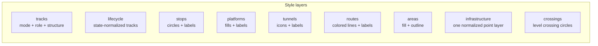

# Consumer Integration Guide

This document describes how to consume the Luxembourg railway infrastructure vector tiles and style in your own MapLibre-based application.

## Quick Start

Add the railway overlay as a second source on top of your basemap:

```javascript
const map = new maplibregl.Map({
  container: "map",
  style: "your-basemap-style-url",
  center: [6.13, 49.61],
  zoom: 8,
});

map.on("load", () => {
  // add the railway tile source
  map.addSource("railway", {
    type: "vector",
    url: "https://your-tile-server/lux-railway-map-overlay",
  });

  // add a single layer (example: active heavy rail tracks)
  map.addLayer({
    id: "rail-tracks-heavy",
    type: "line",
    source: "railway",
    "source-layer": "rail_tracks",
    filter: ["all", ["==", ["get", "mode"], "heavy_rail"], ["==", ["get", "lifecycle_state"], "active"]],
    paint: {
      "line-color": "#1e293b",
      "line-width": 2,
    },
  });
});
```

Or fetch the pre-built style and add its source and layers to your existing map. MapLibre GL JS accepts a single style object or URL at construction time; it does not compose an array of style URLs for you.

```javascript
map.on("load", async () => {
  const overlayStyle = await fetch("https://your-tile-server/style.json")
    .then((response) => response.json());

  for (const [sourceId, source] of Object.entries(overlayStyle.sources)) {
    map.addSource(sourceId, source);
  }

  for (const layer of overlayStyle.layers) {
    if (layer.type !== "background") {
      map.addLayer(layer);
    }
  }
});
```

## Tile Server Endpoints

| Endpoint | Description |
|---|---|
| `/style.json` | Full MapLibre style with all layers pre-configured |
| `/lux-railway-map-overlay` | TileJSON metadata (source URL for `addSource`) |
| `/lux-railway-map-overlay/{z}/{x}/{y}` | Vector tile endpoint |
| `/fonts/{fontstack}/{range}.pbf` | Self-hosted glyph PBFs |
| `/sprite/symbols` | SVG sprite sheet |
| `/health` | Health check |

## Layer Groups at a Glance



## Source Layers

The vector tiles contain the following source layers. Each layer is available from its listed minimum zoom level onward.

### Normalized public layers

| Source Layer | Contents | Min Zoom | Key Properties |
|---|---|---|---|
| `rail_tracks` | Active track geometry plus preserved tracks (`railway=preserved` or `railway:preserved=yes`) | 2 | `mode`, `lifecycle_state`, `track_role`, `structure`, `is_electrified`, `osm_railway` |
| `rail_tracks_lifecycle` | Construction, proposed, disused, abandoned, and razed tracks | 8 | `mode`, `lifecycle_state`, `track_role`, `structure`, `osm_railway` |
| `rail_stops` | Stations, halts, tram stops, subway entrances, border crossings | 7 | `mode`, `stop_type`, `name`, `operator`, `network`, `osm_railway` |
| `rail_routes` | Canonical route geometry (unmodified centerline) | 5 | `mode`, `osm_route`, `ref`, `name`, `operator`, `colour`, `network`, `from`, `to` |
| `rail_routes_display` | Display-ready route geometry (laterally offset for parallel routes) | 5 | Same properties as `rail_routes`, plus display colors and offset slot |
| `rail_crossings` | Road-rail level crossings and tram crossings | 11 | `crossing_type`, `has_barrier`, `has_bell`, `has_light`, `is_supervised` |
| `rail_platforms` | Platform polygons | 10 | `ref`, `name`, `public_transport` |
| `rail_platform_labels` | Synthesized platform label points | 12 | `platform_label`, `platform_label_short`, `platform_name_label`, `platform_ref_label`, `source_layer`, `source_id` |
| `rail_infrastructure_points` | Signals, switches, buffer stops, derails, milestones, turntables, owner changes | 12 | `infra_type`, `name`, `osm_railway` |
| `rail_areas` | Railway land use and facility polygons (excluding platforms) | 8 | `area_type`, `name`, `landuse`, `osm_railway` |
| `rail_tunnel_entrances` | Tunnel entrance points (derived from tunnel start coordinates) | 11 | `infra_type`, `structure`, `name`, `tunnel_name`, `operator` |

### Breaking layer-name mapping

| Old layer | New layer |
|---|---|
| `railway_lines` | `rail_tracks` |
| `railway_lines_lifecycle` | `rail_tracks_lifecycle` |
| `railway_stations` | `rail_stops` |
| `railway_routes` | `rail_routes` |
| `railway_routes_display` | `rail_routes_display` |
| `railway_crossings` | `rail_crossings` |
| `railway_platforms` | `rail_platforms` |
| `railway_platform_refs` | `rail_platform_labels` |
| `railway_signals`, `railway_switches`, `railway_buffer_stops`, `railway_derails`, `railway_track_crossings`, `railway_milestones`, `railway_turntables`, `railway_owner_changes` | `rail_infrastructure_points` with `infra_type` |
| `railway_areas` | `rail_areas` |
| `railway_tunnel_entrances` | `rail_tunnel_entrances` |

## Style Layer Groups

Every layer in `style.json` has `metadata.family` and `metadata.toggle` fields that you can use to build a toggle UI programmatically:

```javascript
// collect all unique groups
const groups = new Set(
  map.getStyle().layers
    .filter((layer) => layer.metadata?.family)
    .map((layer) => layer.metadata.family)
);

// toggle an entire group
function toggleToken(token, visible) {
  for (const layer of map.getStyle().layers) {
    if (layer.metadata?.toggle?.includes(token)) {
      map.setLayoutProperty(
        layer.id,
        "visibility",
        visible ? "visible" : "none"
      );
    }
  }
}
```

Top-level `style.metadata.toggleModes` exposes the supported modes: `heavy_rail`, `light_rail`, `tram`, `metro`, `narrow_gauge`, `monorail`, `funicular`, and `miniature`.

Available families:

| Group | Layers | Default Visibility |
|---|---|---|
| `background` | Transparent background | visible |
| `tracks` | Active and lifecycle tracks styled by `mode`, `track_role`, `structure`, and `lifecycle_state` | visible |
| `stops` | Station, halt, tram stop, metro entrance, and border points | visible |
| `platforms` | Platform fills and labels | visible |
| `routes` | Route lines and along-line labels | visible |
| `infrastructure` | Switches, signals, buffer stops, milestones, turntables, derails, track crossings, owner changes, tunnel entrances | visible |
| `crossings` | Road-rail level crossings | visible |
| `areas` | Railway land use polygons | visible |

## Route Properties

Route layers (`rail_routes` and `rail_routes_display`) contain properties computed during generation:

| Property | Description |
|---|---|
| `ref` | Route reference code (e.g., "RE 11") |
| `name` | Full relation name |
| `route` / `osm_route` | Raw OSM route type (`train`, `tram`, `light_rail`, `subway`) |
| `mode` | Normalized transport mode (`train` becomes `heavy_rail`, `subway` becomes `metro`) |
| `operator` | Operating company |
| `network` | Network name |
| `from` | Resolved origin station name |
| `to` | Resolved destination station name |
| `colour` | Normalized hex color from OSM (uppercase, 6-digit, or empty) |
| `source_colour` | Same as `colour` (preserved before display fallback) |
| `display_colour` | Color used for rendering (falls back to `#5B6675` when no OSM color) |
| `display_text_colour` | Contrast-safe label color (dark for light routes, route color for dark routes) |
| `route_offset_slot` | Lateral offset slot for parallel route separation (0 = centered) |

`rail_routes` contains the original centerline geometry. `rail_routes_display` contains the same routes with geometry offset laterally by `route_offset_slot * 8 meters` so parallel services are visually separated.

## Platform Reference Properties

The `rail_platform_labels` layer synthesizes labels from inconsistent OSM data. Use the following fallback chain for the best available label:

```javascript
["coalesce",
  ["get", "platform_ref_label"],
  ["get", "platform_label_short"],
  ["get", "local_ref"],
  ["get", "ref"]
]
```

| Property | Description |
|---|---|
| `platform_ref_label` | Best available short reference (local_ref, ref, or extracted from IFOPT/description) |
| `platform_label_short` | Same as `platform_ref_label` |
| `platform_name_label` | Platform name extracted from the feature name (e.g., "Quai 1A") |
| `source_layer` | Origin: `rail_platforms` (polygon centroid) or `rail_stops` (stop position) |
| `source_id` | OSM ID of the source feature |

## Filtering Tips

### Rail vs Tram

Tram features live in the same source layers as rail features. Filter on normalized `mode`:

```javascript
// heavy rail only
filter: ["==", ["get", "mode"], "heavy_rail"]

// tram only
filter: ["==", ["get", "mode"], "tram"]
```

### Active vs Lifecycle

Active tracks are in `rail_tracks`. Preserved tracks (`railway=preserved` or `railway:preserved=yes`) also remain in `rail_tracks` and are styled through the `preserved` toggle state. Other non-active states are in `rail_tracks_lifecycle`; both expose `lifecycle_state` (`active`, `construction`, `proposed`, `disused`, `abandoned`, `preserved`, `razed`).

### Station Types

The `rail_stops` source layer contains multiple point types:

| `stop_type` value | Description |
|---|---|
| `station` | Full railway station |
| `halt` | Request stop / minor halt |
| `tram_stop` | Tram stop |
| `subway_entrance` | Subway entrance point |
| `border` | Network boundary crossing; normalized to `mode=heavy_rail` so it is rendered and toggled with heavy rail stops |

## Glyph Requirements

MapLibre text rendering uses glyph PBFs served by the tile server, not browser web fonts. The tile server hosts these font stacks:

- `IBM Plex Sans Regular`
- `IBM Plex Sans Bold`
- `Noto Sans Regular`
- `Noto Sans Italic`
- `Noto Sans Bold`

When composing styles, all participating styles must share a single glyph endpoint that serves every referenced font stack. See the main README for options when your basemap requires additional stacks.

## Data Attribution

Railway data is sourced from [OpenStreetMap](https://www.openstreetmap.org/) and licensed under the [Open Database License (ODbL)](https://opendatacommons.org/licenses/odbl/).

Any public use must include: **© OpenStreetMap contributors**
