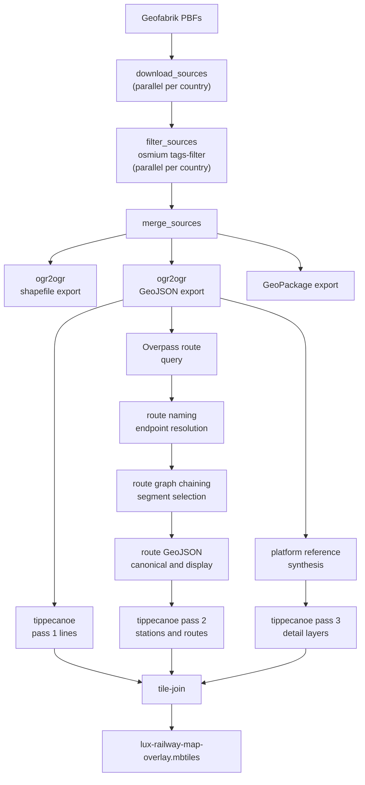
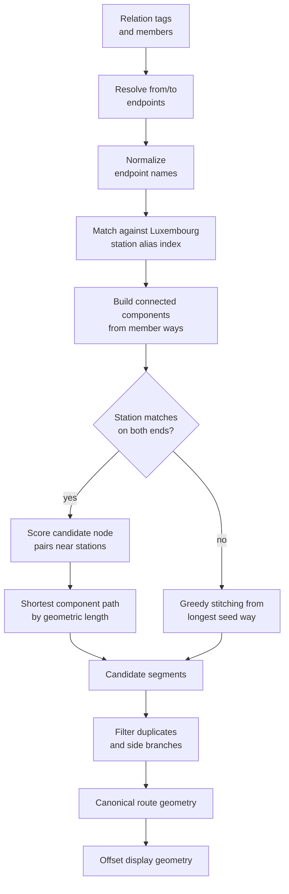

# Developer Pipeline Notes

This document describes the Python generator at a level useful for maintenance, refactoring, and release safety reviews.

## Goals

- keep the pipeline deterministic enough for release automation
- isolate expensive or failure-prone external dependencies
- make route extraction understandable, because it contains the least obvious heuristics in the repository

## High-Level Flow

## Stage Responsibilities

### Source ingestion

- `pipeline_sources.download_sources` downloads country extracts from Geofabrik in parallel and reuses existing files when present.
- `pipeline_sources.filter_sources` reduces each country to railway-relevant tags in parallel before any heavy conversion happens.
- `pipeline_sources.merge_sources` copies directly for single-country runs and merges for multi-country runs.

### Geometry exports

- `convert_shapefiles` keeps the legacy shapefile outputs required by workflows that require the shapefile format.
- `convert_geojson` produces the GeoJSON layers used for vector tile generation and route post-processing.
- `build_platform_reference_layer` synthesizes a label layer because platform references are inconsistently encoded across OSM data sources.

### Route extraction

Route extraction is the only stage that depends on a live third-party API at generation time.

- the generator requests route relations from Overpass for the Luxembourg bounding box
- `routes.write_routes_geojson` keeps only relations whose endpoints resolve to Luxembourg station aliases
- route members are converted to graph records in `route_graph.chain_ways`
- the graph search tries to identify the component path that best connects the resolved `from` and `to` stations
- the display export offsets overlapping services laterally so multiple colored routes stay legible

## Route Failure Policy

Route extraction is strict by default.

Why:

- release automation should not publish a valid image that silently omits routes
- route layers are user-visible and semantically important, not optional metadata
- a failed Overpass query is an operational problem, not just a styling degradation

For local/manual runs only, the CLI supports `--allow-missing-routes`. In that mode, Overpass failure produces empty route layers so a developer can still inspect the rest of the dataset.

## Route Resolution Heuristics

### Why the route code is non-trivial

OSM route relations are not guaranteed to be:

- ordered
- contiguous
- deduplicated
- limited to one service variant
- tagged with clean endpoint names

The current approach deliberately uses heuristics instead of assuming relation members already form one clean polyline.

## Vector Tile Strategy

The pipeline generates three intermediate MBTiles files before merging them:

1. `lines.mbtiles`
2. `stations.mbtiles`
3. `detail.mbtiles`

This avoids forcing one tippecanoe dropping strategy onto all layer families.

- lines are preserved aggressively because losing trunk geometry is unacceptable
- stations and routes must remain present for labeling and network comprehension
- dense detail layers can be thinned at low zoom without breaking the overlay

## Release Safety Checks

Publishing now relies on two protections:

1. route extraction fails hard by default if Overpass is unavailable
2. the publish workflow verifies that both route GeoJSON outputs exist and are not empty before bundling the runtime image

That combination prevents a silent route regression from being baked into a production image.

## Recommended Maintenance Rules

- keep `pipeline.py` as orchestration, not as a dumping ground for data logic
- when refactoring route code, add or update tests first because the heuristics are easy to regress subtly
- prefer explicit failure in release paths when an external dependency changes data completeness
- document scoring heuristics whenever a new threshold or ranking rule is introduced
