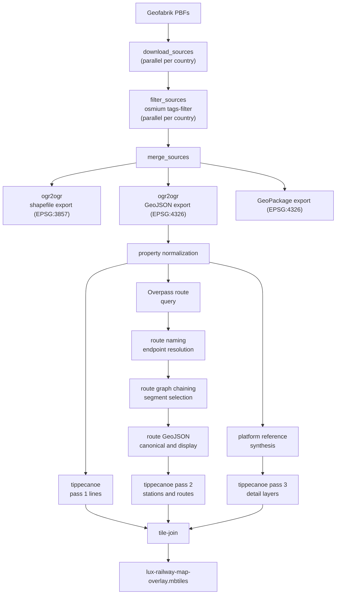
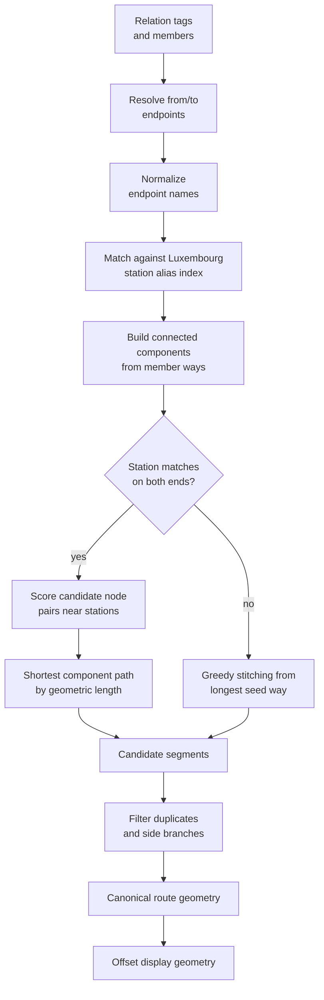

# Developer pipeline notes

These notes describe the Python generator in `scripts/generator/`: how to run it, where it writes, how each stage works, and how CI checks it. Read them before you refactor the pipeline or change what a release publishes.

## Run the generator

The Docker route needs nothing but Docker. It is described in the [README](../README.md#generate-the-data-yourself).

To run without Docker, install Python 3.13 or newer and put these tools on your `PATH`:

| Tool                                                             | Used for                                                       |
| ---------------------------------------------------------------- | -------------------------------------------------------------- |
| [osmium-tool](https://osmcode.org/osmium-tool/)                  | Filtering and merging OpenStreetMap PBF extracts               |
| [GDAL](https://gdal.org/) (`ogr2ogr`)                            | Converting PBF data to GeoJSON, shapefiles, and GeoPackage     |
| [tippecanoe](https://github.com/felt/tippecanoe) and `tile-join` | Building and merging the MBTiles                               |

The generator checks for `osmium`, `ogr2ogr`, `tippecanoe`, and `tile-join` at startup. `shapeindex` from Mapnik is optional. Without it, the generator skips the shapefile spatial indexes.

```bash
python3 -m venv .venv
.venv/bin/pip install -e ".[dev]"
cd scripts && ../.venv/bin/python -m generator --countries lu --output-dir ../data
```

Run it from `scripts/`. `ogr2ogr` writes temporary node cache files to the working directory.

Then serve the result with `docker compose up` from the repository root.

## Output layout

`--output-dir` (default `./data`) holds three directories with different lifetimes:

| Directory       | Contents                                                                                                   | Lifetime                                       |
| --------------- | ---------------------------------------------------------------------------------------------------------- | ---------------------------------------------- |
| `cache/`        | Raw Geofabrik extracts in `cache/sources/` and the Overpass response in `cache/overpass/overpass_routes.json` | Kept across runs to avoid repeat downloads     |
| `intermediate/` | Filtered and merged PBFs, GeoJSON layers, shapefiles, and per-pass MBTiles                                 | Working state. Safe to delete at any time.      |
| `out/`          | `lux-railway-map-overlay.mbtiles` and `railway-data.gpkg`                                                  | Final deliverables                             |

The tile server and anything outside the repository should read only from `out/`. The publish workflow is the one exception. It checks route presence in `intermediate/geojson/`.

The GeoPackage is in EPSG:4326 and has three layers: `rail_tracks` (every line with a `railway` tag), `rail_infrastructure_points` (every point with a `railway` tag), and `rail_areas` (every polygon with a `railway` tag). It holds raw OSM attributes, not the normalized tile schema.

### Reuse and refresh

The generator reuses earlier work:

- It skips a country's download if `intermediate/sources/<code>-railway.osm.pbf` exists, or if the raw extract in `cache/sources/` exists and is not empty.
- It always uses `cache/overpass/overpass_routes.json` when that file exists, and only queries Overpass when it does not.

To pick up new OpenStreetMap edits, delete the matching files:

```bash
rm -rf data/cache/sources data/intermediate/sources   # fresh Geofabrik extracts
rm -f data/cache/overpass/overpass_routes.json        # fresh route relations
```

## Pipeline stages


```mermaid
flowchart TD
    A[Geofabrik PBFs] --> B["download_sources<br/>(parallel per country)"]
    B --> C["filter_sources<br/>osmium tags-filter<br/>(parallel per country)"]
    C --> D[merge_sources]
    D --> E["ogr2ogr<br/>shapefile export (EPSG:3857)"]
    D --> F["ogr2ogr<br/>GeoJSON export (EPSG:4326)"]
    F --> F2[property normalization]
    F2 --> G[platform reference<br/>synthesis]
    F2 --> H[Overpass route<br/>query]
    H --> I[route naming<br/>endpoint resolution]
    I --> J[route graph chaining<br/>segment selection]
    J --> K[route GeoJSON<br/>canonical and display]
    F2 --> L[tippecanoe<br/>pass 1 lines]
    K --> M[tippecanoe pass 2<br/>stations and routes]
    G --> N[tippecanoe pass 3<br/>detail layers]
    L --> O[tile-join]
    M --> O
    N --> O
    O --> P[lux-railway-map-overlay.mbtiles]
    D --> Q["GeoPackage export (EPSG:4326)"]
```

`GeneratorPipeline` in `pipeline.py` runs the stages in order. Keep it as orchestration and put data logic in the stage modules.

### Source ingestion

- `pipeline_sources.download_sources` downloads country extracts from Geofabrik in parallel and reuses existing files.
- `pipeline_sources.filter_sources` reduces each country to railway-relevant tags in parallel, before any heavy conversion.
- `pipeline_sources.merge_sources` copies the file for single-country runs and merges for multi-country runs.

### Geometry exports

- `convert_shapefiles` writes shapefiles to `intermediate/shp/` for consumers that need that format.
- `convert_geojson` writes the GeoJSON layers used for tiles and route processing.
- `normalize_geojson` adds the normalized tile schema (`mode`, `lifecycle_state`, `stop_type`, `infra_type`, and so on) in `normalization.py`.
- `build_platform_reference_layer` builds `rail_platform_labels`, because OSM encodes platform references inconsistently.

### Route extraction

Route extraction is the only stage that calls a live third-party API.

- The generator asks Overpass for route relations inside the Luxembourg bounding box. It tries three Overpass mirrors in turn.
- `routes.write_routes_geojson` keeps only relations whose endpoints resolve to Luxembourg station aliases.
- `route_graph.chain_ways` turns relation members into graph records.
- The graph search looks for the component path that best connects the resolved `from` and `to` stations.
- The display export offsets overlapping services sideways so several colored routes stay legible.

## Route failure policy

Route extraction is strict by default. If Overpass fails and there is no cached response, the run fails.

The reasons:

- Release automation must not publish an image that silently lacks routes.
- Routes are visible and meaningful to users. They are not optional metadata.
- A failed Overpass query is an operational problem, not a styling detail.

For local runs, `--allow-missing-routes` turns the failure into a warning. The generator keeps existing route GeoJSON if there is any, and otherwise writes empty route layers, so you can still inspect the rest of the data.

## Route resolution heuristics


```mermaid
flowchart TD
    A[Relation tags<br/>and members] --> B[Resolve from/to<br/>endpoints]
    B --> C[Normalize<br/>endpoint names]
    C --> D[Match against Luxembourg<br/>station alias index]
    D --> E[Build connected components<br/>from member ways]
    E --> F{Station matches<br/>on both ends?}
    F -- yes --> G[Score candidate node<br/>pairs near stations]
    G --> H[Shortest component path<br/>by geometric length]
    F -- no --> I[Greedy stitching from<br/>longest seed way]
    H --> J[Candidate segments]
    I --> J
    J --> K[Filter duplicates<br/>and side branches]
    K --> L[Canonical route geometry]
    L --> M[Offset display geometry]
```

OSM route relations are not guaranteed to be ordered, contiguous, deduplicated, limited to one service variant, or tagged with clean endpoint names. The code uses heuristics for this instead of assuming the members already form one clean line.

When several relations produce the same route, the generator keeps the one with the most geometry points, then the richest metadata, then the fewest segments.

## Vector tile strategy

tippecanoe runs three passes in parallel, each with its own dropping rules, and `tile-join` merges the results into `out/lux-railway-map-overlay.mbtiles`. All passes stop at zoom 14.

| Pass           | Layers                                                                 | Flags                                                        | Why                                                                                      |
| -------------- | ---------------------------------------------------------------------- | ------------------------------------------------------------ | ---------------------------------------------------------------------------------------- |
| 1. `lines`     | `rail_tracks`, `rail_tracks_lifecycle`                                 | `-r1 --no-tile-size-limit --no-feature-limit`                | Losing trunk geometry is not acceptable, and the coverage area does not fit in 500 KB tiles at low zoom |
| 2. `stations`  | `rail_stops`, `rail_routes`, `rail_routes_display`                     | `-r1 --no-tile-size-limit`                                   | Stops and routes must be present wherever the style shows them                           |
| 3. `detail`    | Crossings, platforms, platform labels, infrastructure points, areas, tunnel entrances | `--drop-densest-as-needed --extend-zooms-if-still-dropping` | Dense detail can be thinned at low zoom without hurting the overlay                      |

`tile-join` also sets the tileset name and the `© OpenStreetMap contributors` attribution. The minimum zoom of each layer is in `layer_specs.py`.

## Checks and CI

Local checks:

```bash
.venv/bin/black --check scripts tests
.venv/bin/pytest
dotnet tool restore && dotnet csharpier check viewer
```

`.venv/bin/pre-commit install` runs Black, CSharpier, and actionlint as Git hooks. The actionlint hook runs in Docker.

Two workflows run in GitHub Actions:

- `validate.yml` runs on pull requests and on pushes to `main` that touch the generator, tests, styles, tile server, viewer, or workflows. It runs actionlint, Black, pytest, and CSharpier, and builds the generator and tile server images without pushing them. It does not download extracts or call Overpass.
- `publish-image.yml` runs on pushes to `main` that touch the generator, styles, tile server, or Compose file, once a month on a schedule, and on manual dispatch. It generates the full dataset, fails if either route GeoJSON file is empty, builds `tiles/Dockerfile.bundle` with the MBTiles baked in, and pushes `latest` and `sha-<commit>` tags to GHCR. It caches `data/cache/overpass/` and `data/intermediate/sources/` per calendar month. A manual run with `fresh` enabled skips that cache.

Together, strict route extraction and the route check in `publish-image.yml` stop a route regression from reaching a published image.

## Maintenance rules

- Keep `pipeline.py` as orchestration.
- Add or update tests before refactoring route code. The heuristics regress in subtle ways.
- Prefer explicit failure in release paths when an external dependency changes data completeness.
- Document scoring heuristics whenever you add a threshold or ranking rule.
- `tests/generator/test_style_contract.py` checks parts of `styles/style.json`, including default visibility. Update it when you change the style on purpose.
